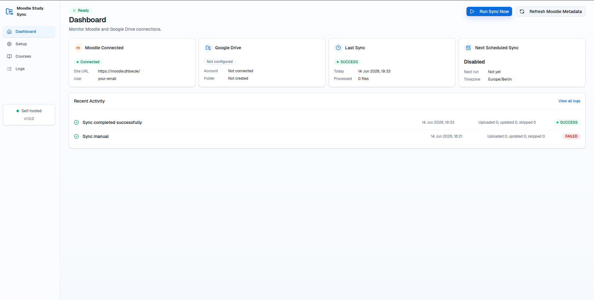
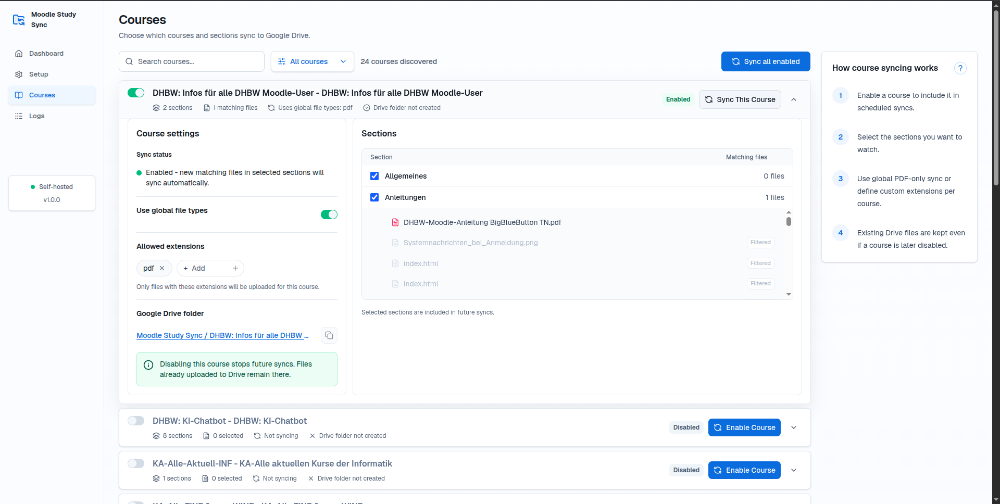
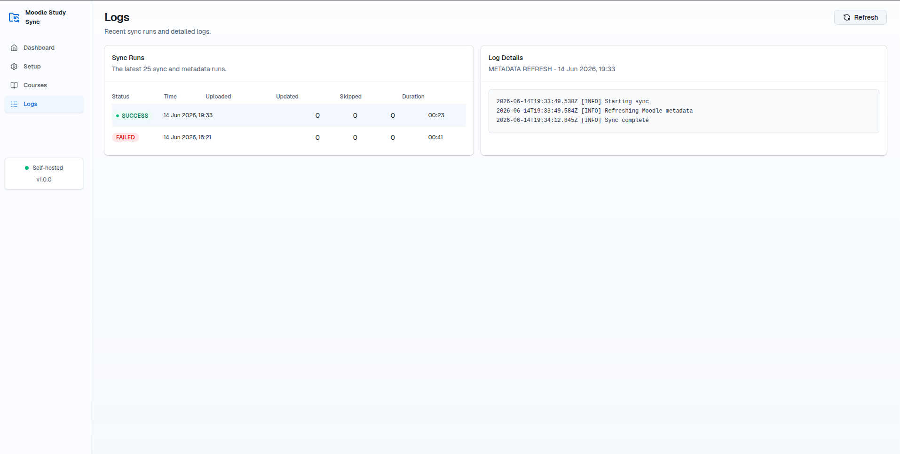
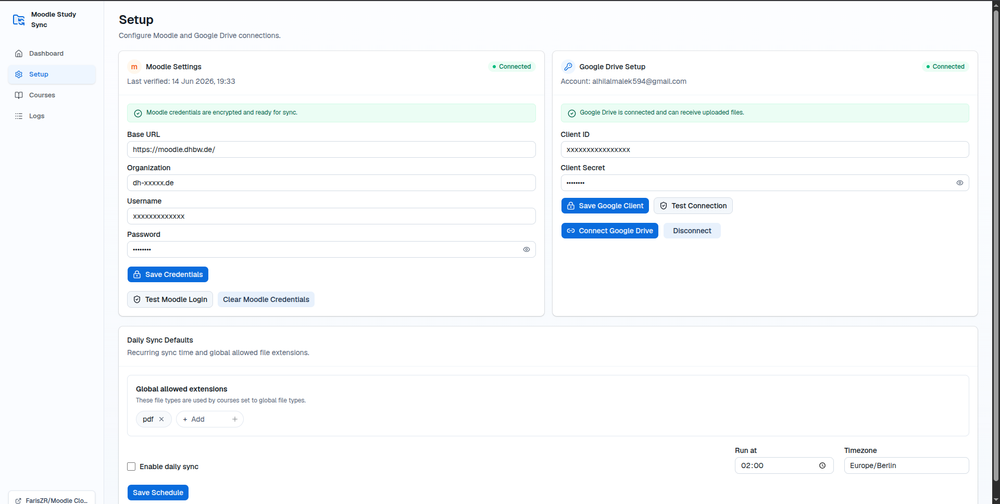

# Moodle Study Sync

   

Self-hosted web app that syncs selected DHBW Moodle course files to Google Drive.

it emulates the Moodle mobile token login flow to access course files and the Google device flow for Drive access. Syncs run on demand or on a schedule, with detailed logs and error handling.

## Stack

- Next.js App Router
- TypeScript
- Tailwind CSS
- Prisma 7 with SQLite
- Google Drive device flow
- Moodle mobile-token login flow

## Docs

- `docs/quick-start.md`
- `docs/architecture.md`

## Docker

Build and run with:

```bash
docker build -t moodle-study-sync .
docker run -p 3000:3000 -v $(pwd)/data:/app/data moodle-study-sync
```

Then watch live logs with:

```bash
docker logs -f <container-id>
```

The app writes sync logs under `/app/data/logs` inside the container.

The container entrypoint automatically runs `prisma db push` before starting Next.js.
